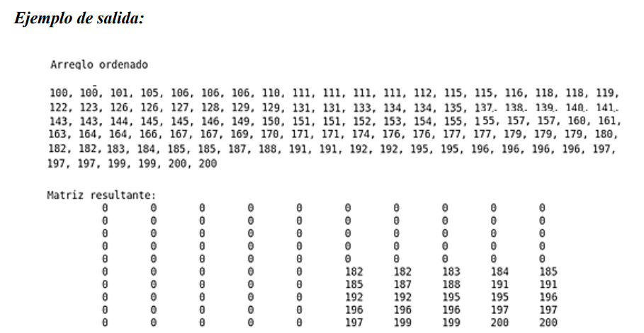
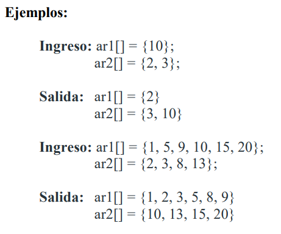

-  Elaborar un programa tal que dado un vector con elementos repetidos realice las siguientes
tareas:

1) Visualizar los elementos del vector ordenados en forma creciente.
2) Presentar todos los elementos diferentes del vector (sin repeticiones)
3) Obtener la frecuencia de cada elemento del vector.
4) Ordenar y visualizar los elementos del vector de frecuencias en forma decreciente.
5) Presentar la moda del vector y su frecuencia.

Un ejemplo de ejecución es:
- Entrada: 
Vector Inicial 
64 25 25 12 12 25 12 64 22 12

- Salida: 
Vector Ordenado 
12 12 12 12 22 25 25 25 64 64

Vector sin repeticiones 
12 22 25 64

Frecuencias de elementos del vector: 
12, Frecuencia = 4 
22, Frecuencia = 1 
25, Frecuencia = 3 
64, Frecuencia = 2 

Ordenado por Frecuencias 
4 3 2 1

La moda es 12, su frecuencia es 4.

- Generar una matriz de 10x10 que tenga el último cuadrante lleno, con los mayores
elementos de una serie de 100 números generados aleatoriamente (valores entre 100 y 200). Los
otros elementos de la matriz estarán en cero. Los números generados deben ordenarse.

Mostrar el arreglo ordenado de 100 elementos y la matriz resultante.

- Ordenar la matriz por filas

- Ordenar una matriz por columnas

- Ordenar por diagonal

- Dados dos vectores ordenados. Los valores de los dos vectores distribuirlos de manera
que los menores valores estén en la primer vector (acordes a su longitud) y los números restantes
estén en el segundo vector ordenado.

